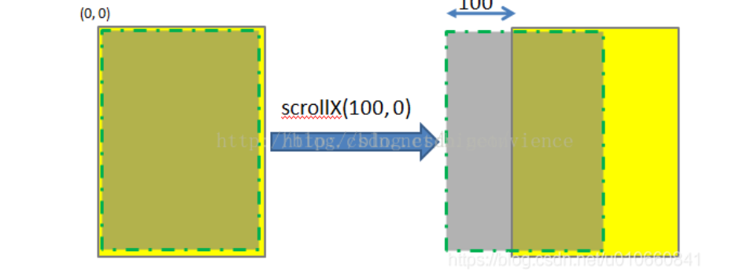
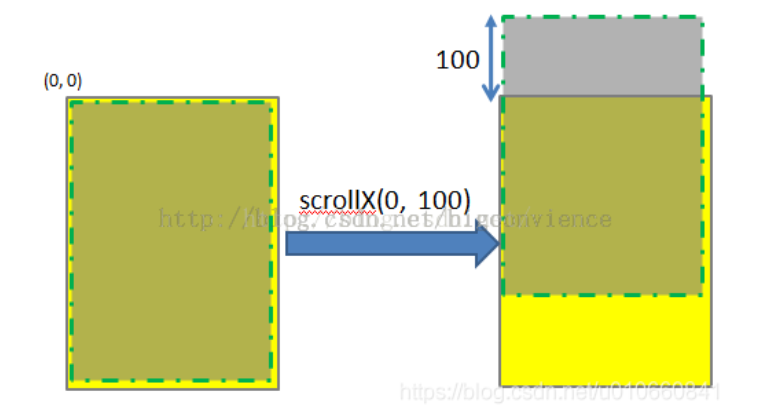
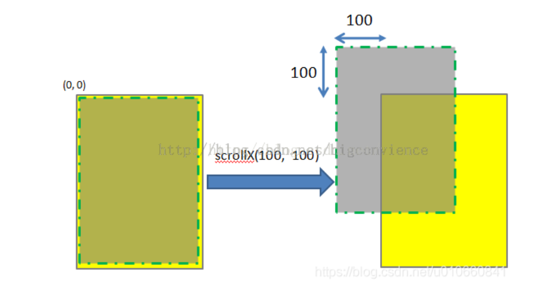

# Android学习笔记

## 2022.3.13  

### 1.Contentprovider接收端无法访问的问题

​	需要在接收端AndroidManifest中添加权限

```
<uses-permission android:name="exampleProvider._READ_PERMISSION" />
<uses-permission android:name="exampleProvider._WRITE_PERMISSION" />
```

## 2022.3.22 

### 1.Apache 无法访问htdocs中的xml文件问题

需要配置apache的文件访问路径


注意路径分割用的是"/"

### 2.配置允许我们以明文的方式在网络上传输数据而HTTP使用的就是明文传输方式

```xml
<?xml version="1.0" encoding="utf-8"?>
<network-security-config>
<base-config cleartextTrafficPermitted="true">
<trust-anchors>
<certificates src="system" />
</trust-anchors>
</base-config>
</network-security-config>


```

## 2022.3.23

### 1.但是前一天晚上可以访问，第二天就出现Failed to connect to /10.0.2.2:80的问题

分析原因可能是第二天重新联网后被分配的IP地址发生变化，模拟器原来分配的地址无法访问到网址，擦除数据即可；

### 2.引入各种网络库的代码

1）okhttp：implementation 'com.squareup.okhttp3:okhttp:4.9.3'

2）gson：implementation 'com.google.code.gson:gson:2.8.5'

3）retrofitTest: implementation 'com.squareup.retrofit2:retrofit:2.6.1'
							implementation 'com.squareup.retrofit2:converter-gson:2.6.1'

因此添加上述第一条依赖会自动将Retrofit、OkHttp和Okio这几个库一起下载，我们无须再手动引入OkHttp库。另外，Retrofit还会将服务器返回的JSON数据自动解析成对象，因此上述第二条依赖就是一个Retrofit的转换库，它是借助GSON来解析JSON数据的，所以会自动将GSON库一起下载下来，这样我们也不用手动引入GSON库了。

### 3.socket failed: EPERM (Operation not permitted)

没打开网络授权权限；

### 4.协程的依赖库

```kotlin
implementation "org.jetbrains.kotlinx:kotlinx-coroutines-core:1.1.1"
implementation "org.jetbrains.kotlinx:kotlinx-coroutines-android:1.1.1"
```

### 5.协程作用域创建方法

GlobalScope.launch、runBlocking、launch、coroutineScope这几种作用域构建器，它们都可以用于创建一个新的协程作用域。不过
GlobalScope.launch和runBlocking函数是可以在任意地方调用的，coroutineScope函数可以在协程作用域或挂起函数中调用，而launch函数只能在协程作用域中调用。

## 2022.3.28

### 1.Github

将项目push时遇到问题，因为GitHub的默认主支名称由原来的master改为了main；

## 2022.7.8

### 1. View Binding的使用

需要在项目工程文件下添加配置

```
android{
***
buildFeatures{
	viewBinding true
}
}
```


#### 1.1 在Activity中的使用

一旦启动了ViewBinding功能之后，Android Studio会自动为我们所编写的每一个布局文件都生成一个对应的Binding类。

Binding类的命名规则是将布局文件按驼峰方式重命名后，再加上Binding作为结尾。

比如说，前面我们定义了一个activity_main.xml布局，那么与它对应的Binding类就是ActivityMainBinding。

当然，如果有些布局文件你不希望为它生成对应的Binding类，可以在该布局文件的根元素位置加入如下声明：


```
<LinearLayout
    xmlns:tools="http://schemas.android.com/tools"
    ...
    tools:viewBindingIgnore="true">
    ...
</LinearLayout>

```

如何设置

```
class MainActivity : AppCompatActivity() {

    override fun onCreate(savedInstanceState: Bundle?) {
        super.onCreate(savedInstanceState)
        val binding = ActivityMainBinding.inflate(layoutInflater)//利用ActivityManinBinding的inflate函数去加载布局，inflate()函数接收一个LayoutInflate参数，在Activity中是可以直接获取的
        setContentView(binding.root)//调用Binding类的getRoot()函数就可以得到xml中根元素的实例,setContentView()函数当中，这样Activity就可以成功显示activity_main.xml这个布局的内容了
        binding.textView.text = "Hello"//调用getTextView()函数可以获得id为textView的元素实例
    }

}

```

## 2022 .7.11

### 1. 动态添加Fragment的做法

动态添加Fragment主要分为5步。

(1) 创建待添加Fragment的实例。

(2) 获取FragmentManager，在Activity中可以直接调用getSupportFragmentManager()方法获取。

(3) 开启一个事务，通过调用beginTransaction()方法开启。

(4) 向容器内添加或替换Fragment，一般使用replace()方法实现，需要传入容器的id和待添加的Fragment实例。

(5) 提交事务，调用commit()方法来完成。

### 2. 根据屏幕和分辨率的大小动态的加载布局的功能

#### 2.1  android中常见的限定符

| 屏幕特征 | 限定符 | 描述                                            |
| -------- | ------ | ----------------------------------------------- |
| 大小     | small  | 提供给小屏幕设备的资源                          |
|          | normal | 提供给中等屏幕设备的资源                        |
|          | large  | 提供给大屏幕设备的资源                          |
|          | xlarge | 提供给超大屏幕设备的资源                        |
| 分辨率   | ldpi   | 提供给低分辨率设备的资源（120 dpi以下）         |
|          | mdpi   | 提供给中等分辨率设备的资源（120 dpi~160 dpi）   |
|          | hdpi   | 提供给高分辨率设备的资源（160 dpi~240 dpi）     |
|          | xhdpi  | 提供给超高分辨率设备的资源（240 dpi~320 dpi）   |
|          | xxhdpi | 提供给超超高分辨率设备的资源（320 dpi~480 dpi） |
| 方向     | land   | 提供给横屏设备的资源                            |
|          | port   | 提供给竖屏设备的资源                            |

#### 2.2 使用最小宽度限定符

## 2022-7-14

### RecycleView的设置

1.在XML文件中定义布局

2.需要定义显示在子项中的实例类

3.需要定义子项布局XML文件

4.需要生成适配器，适配器传入数据源并且继承RecyclerView.Adapter并且为其指定泛型为XXX.ViewHolder

5.适配器内定义内联类ViewHolder它要继承自RecyclerView.ViewHolder。然后ViewHolder的主构造函数中要传入一个View参数，这个参数通常就是RecyclerView子项的最外层布局，那么我们就可以通过findViewById()方法来获取布局中ImageView和TextView的实例了。

6.需要重写三个，那么就必须重写onCreateViewHolder()、onBindViewHolder()和getItemCount()这3个方法。onCreateViewHolder()方法是用于创建ViewHolder实例的，onBindViewHolder()方法用于对RecyclerView子项的数据进行赋值，会在每个子项被滚动到屏幕内的时候执行，getItemCount()方法就非常简单了，它用于告诉RecyclerView一共有多少子项，直接返回数据源的长度就可以了

## 2022-9.1

### Gradle相关配置

#### abi

```groovy
ndk {
    abiFilters "arm64-v8a","x86"
}
```

ABI 是 Application Binary Interface 的缩写

不同的Android手机要使用不同的CPU，因此支持不同的指令集。CPU与指令集的每种组合都有其自己应用的二进制界面（或**ABI**）

典型的ABI包含以下信息：

* 机器代码应使用的CPU指令集
* 运行时内存存储何加载的字节顺序
* 可执行二进制文件（例如程序和共享库）的格式，以及它们支持的内容类型。
* 用于解析内容与系统之间数据的各种约定。这些约定包括对齐限制，以及系统如何使用堆栈和在调用函数时注册。
* 运行时可用于机器代码的函数符号列表 - 通常来自非常具体的库集。

#### 如何自定义打包文件名称

```groovy
applicationVariants.all{ variant ->
    variant.outputs.all{
        outputFileName = "SKLauncher_${variant.versionName}.apk"
    }
}
```

#### sourceSets

java插件引入了一个概念叫做SourceSets，通过修改SourceSets中的属性，可以指定哪些源文件（或文件夹下的源文件）要被编译，哪些源文件要被排除。[Gradle](https://so.csdn.net/so/search?q=Gradle&spm=1001.2101.3001.7020)就是通过它实现Java项目的布局定义。

####  lintOptions

 lintOptions 配置，其作用是 **协助我们发现项目中代码质量问题**。

## 2022.9.4

### 1、handler弱引用

#### 1.1 Handler内存泄漏说明

```java
Handler mHandler = new Handler(){
            @Override
            public void handleMessage(Message msg) {
                super.handleMessage(msg);
                switch (msg.what) {
                    case 99:
                        // do something
                        sendEmptyMessageDelayed(100, 2000);
                        break;
                    case 100:
                        // do something
                        break;
                    default:break;
                }
            }
        };
	mHandler.sendEmptyMessage(99);

```

```
mHandler会作为成员变量保存在发送的消息msg中，即msg持有mHandler的引用，而mHandler是Activity的非静态内部类实例，即mHandler持有Activity的引用，那我们就可以理解为msg间接持有Activity的引用。msg被发送后先放到消息队列MessageQueue中，然后等待Looper的轮询处理（MessageQueue 和 Looper 都是与线程相关联的， MessageQueue 是 Looper 引用的成员变量，而 Looper 是保存在ThreadLocal 中的）。那么当 Activity 退出后，msg 可能仍然存在于消息对列MessageQueue 中未处理或者正在处理，那么这样就会导致 Activity 无法被回收，以致发生Activity 的内存泄露。

```

通常在Android开发中如果要使用内部类，但又要规避内存泄漏，一般都会采用**静态内部类+弱引用**的方式优化一下Handler

### 2、Android merge的使用

**目的**：减少布局层数

**效果**：减少视图树种的节点个数，加快视图的绘制，提高UI性能

**何时使用：**

1.子视图不需要指定任何针对夫视图的布局属性

2.假如需要在LinearLayout里面嵌入一个布局（或者视图），而恰恰这个布局的更节点也是LinearLayout，这样就多了一层没有用的嵌套，无疑会拖慢程序的速度。而这个时候如果使用merge标签就可以避免这样的问题

## 2022.9.7

### 1、ViewPager，ScrollView 嵌套ViewPager滑动冲突解决

#### 1.1 View事件的分发机制

View的事件分发机制主要涉及到以下三个方法

* dispatchTouchEvent，这个方法主要是用来分发事件的
* onInterceptTouchEvent，这个方法主要是用来拦截事件的（需要注意的是ViewGroup才有这个方法，View没有）
* onTouchEvent 这个方法主要是用来处理事件的
* requestDisallowInterceptTouchEvent(true)，这个方法能够影响父View是否拦截事件，true表示父View不拦截事件，false表示父View拦截事件

## 2022.9.9

### 1、Android View的scrollTo()、scrollBy()和Scroller类总结

#### 1.1 View的scrollTo()、scrollBy()

##### 1.1.1 scrollTo scrollBy 使用说明

* scrollTo、scrollBy()方法是View中的，因此任何的View都可以通过这两种方法进行移动。首先要明白的是，scrollTo、scrollBy滑动的是View中的内容（而且还是整体滑动），而不是View本身。我们的滑动控件如SrollView可以限定宽、高大小，以及在布局中的位置，但是滑动控件中的内容（或者里面的childView）可以是无限长、宽的，我们调用View的scrollTo、scrollBy方法，相当于是移动滑动控件中的画布Canvas，然后进行重绘，屏幕上也就显示相应的内容。

1.1.2 scrollTo使用介绍

* 调用scrollTo(100,0)表示将View中的内容移动到距离内容初始显示位置的x=100,y=0的地方，效果如下图



* 调用scrollTo(0,100)效果如下图



* 调用scrollTo(100,100)效果如下图



#### 1.1.3 scrollBy使用介绍

* 调用scrollBy(0,100)表示将View中的内容移动到原内容基础上x=x+0,y=y+100的地方，所以scrollBy是在原来的基础上移动的，效果如下图：

  scrollBy()的源码中也非常简单调用的是scrollTo(),只不过加上了当前的mScrollx或者mscrollY
